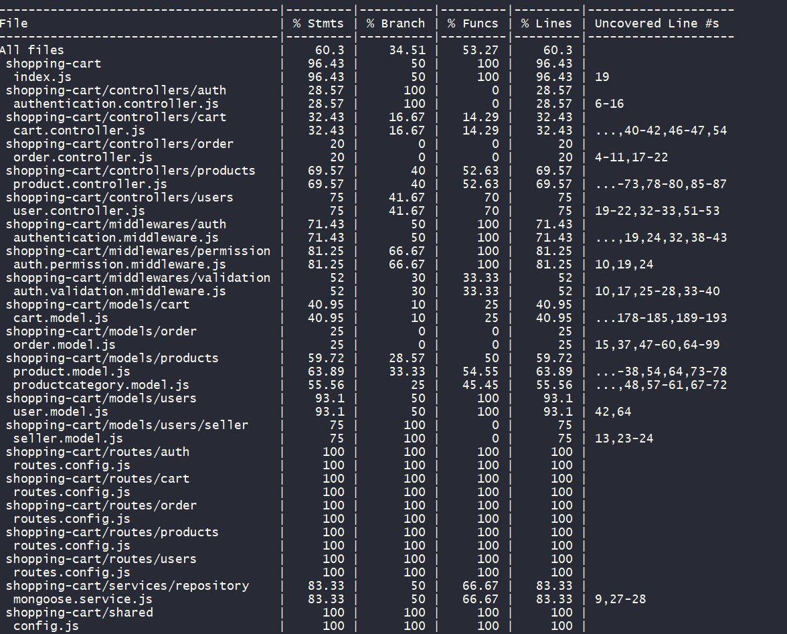

# shopping-cart

# Shopping cart using NodeJS and MongoDB

## Configuration

- **Platform:** node v14.15.1
- **Framework**: express
- **Database**: MongoDB with Mongoose
- **Testing**: chai, mocha and istanbul

## Postman Collection URL
- **https://documenter.getpostman.com/view/434712/TVmQcvFr**

**Code coverage** -

# MongoDB Conceptual Design
## Collections:
#### Product Category
Id, category_name, created_by, created_on, updated_by, updated_on

---

#### Products
Id, sku, title, category_id, quantity, price, description, pictures, videos, limit_per_customer, seller_id, created_on, updated_on

---

### User
Id, first_name, middle_name, last_name, email_id, password, dob, contanct_number, role_id, address1, address2, city, state, country, pin_code, created_on, updated_on

---

### Seller
Id, user_id, logo, about_us

---

### Role
Id, role, created_on, updated_on

> There are 3 roles :
1. Customer
2. Seller
3. Administrator

---

### Cart
> (capture the state of cart at any point of time)
 A cart is a temporary storage for products till they are placed as an order.
 In the cart you can change the product quantities, remove products and add new products.
 when user is not logged in, then local storage or cookies can be used to
  store cart data.
 When a user is logged in, then we need to persist data on the server side so that cart data can  be shared across multiple devices.
 
Id, total, active, created_on, updated_on

---

### Cart_Products
id, cart_id, product_id, quantity, sub_total, created_on, updated_on

---

### Order

>  order is the final storage for products. Cart should be marked inactive after order placement.

Id, cart_id, total_amount, created_by, created_on

---

### Order_Products
> here we need to duplicate the details to avoid joins while fetching data and to avoid product table updates (such as price changes) affecting the original order details.

Id, order_id, product_id, product_name, product_price, quantity, sub_total, created_on

---

### Future Inclusions:
- **Payment Methods Provided By Seller**
- **Payment Method Used By Customer**
- **Shipment Tracking**
- **Use of Coupons while placing order**
- **Cart Abandonment Tracking Using GA**

# Shopping Cart API

#### APIs are divided in five types

1. Authentication and Authorization API

   * POST /login : Login for user
   * POST /logout : Logout for user
   * Express Middlewares used for Authorization

 2. Users And Sellers API
 
     * POST /users : Register a user
     * POST /seller : Any Authenticated user can become a seller
     * GET /users/:id : Get user data by user id. Only user himself or admins can use this API.
     * GET /users: Only admin can get the list of all the users.
     * PATCH /users/:userId : Update Partial Data of a user. Only user himself or admin can do it.

3. Products

      * POST  /products : Only a seller or admin can add a product
      * GET  /products: list all the products
      * GET /categories: list all the product categories
      * GET /categories/:categoryId/products : list all the products of a category
      * GET /products/:productId : get the details of a product
      * PATCH /products/:productId : partially update the product data
      * DELETE /products/:productId : delete the product resource from storage

3. Cart API

     * GET /cart/:userId : get the active cart associated with the user
     * POST /cart/:cartId/products/ : Add a product to a cart
     * GET /cart/:cartId/products : list all the products of a cart
     * PATCH /cart/:cart/products/:productId : partially update the product data in an existing cart
     * DELETE /cart/:cartId/products/:productId : delete the product from a cart
     
 5. Order API
 
     * POST /orders/:cartId : place an order
     * GET /orders/:orderId : Get Order Detail